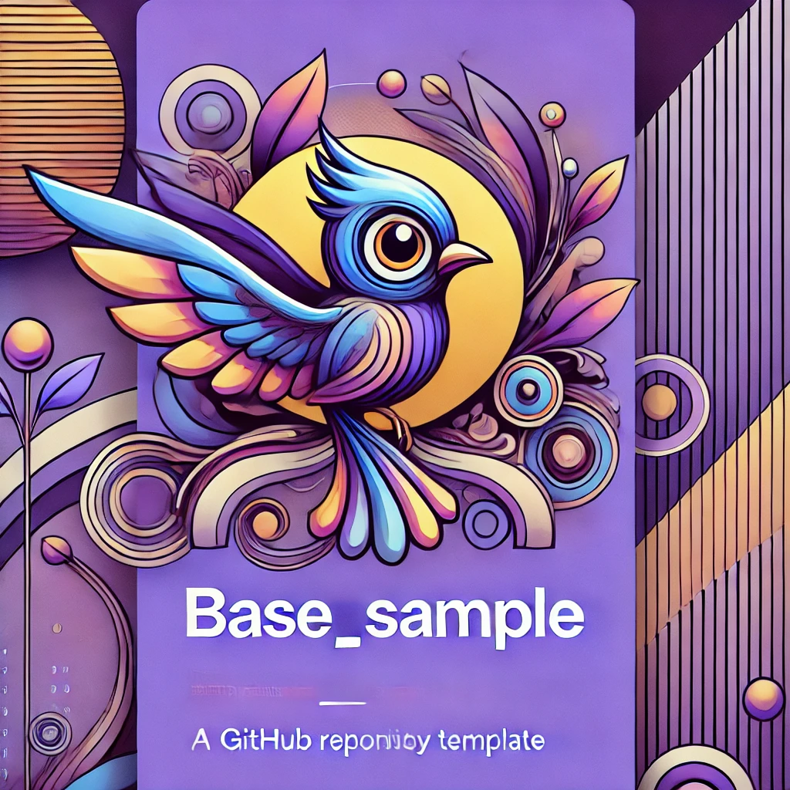

# base_sample



> [!NOTE]
>  このプロジェクトのFlutterSDKは **3.35.4** です。
## 概要
このプロジェクトはサンプルプロジェクトを作るにあたっての雛形となるプロジェクトです。

この雛形プロジェクトからサンプル用のプロジェクトを構築する流れを以下の記事に記しています。
[【Flutter】学習・開発効率UP！雛形からサンプル用プロジェクト構築ガイド](https://zenn.dev/harx/articles/23cac8d1e15d35)

## VScodeの拡張と設定

.vscode/settings.jsonには以下の拡張機能を使う前提で設定が書かれています。
- Code Spell Checker
  - https://marketplace.visualstudio.com/items?itemName=streetsidesoftware.code-spell-checker
- Better Comments
  - https://marketplace.visualstudio.com/items?itemName=aaron-bond.better-comments
- Todo Tree
  - https://marketplace.visualstudio.com/items?itemName=Gruntfuggly.todo-tree

## fvmによるバージョン管理

このプロジェクトにはfvmを使用してFlutterのバージョン管理をしています。

[fvm](https://pub.dev/packages/fvm)

## pubspec.yaml
以下はすでにインストール済みです。不要であれば削除してください。
  - riverpodとhooks関連
  - freezedとjson関連
  - logger
  - gap
  - very_good_analysis
  - derry
  - rename_app
  - utility_widgets
  - go_router
またderryで使うスクリプトも登録済みです。

## analysis_options.yaml

リントはvery_good_analysisをもとに各種設定しています。

## .gitignore

自動生成関連の差分は除外しているので、都度生成が必要です。
derryコマンドを使用して運用してください。

## アーキテクチャ

RiverpodArchitectureを基本としています。

[Flutter App Architecture with Riverpod: An Introduction](https://codewithandrea.com/articles/flutter-app-architecture-riverpod-introduction/)

主要なディレクトリ構造は以下のとおりです。

```
lib
├── applications
│   └── services
├── core
│   ├── constants
│   │   └── constants.dart
│   ├── log
│   │   └── logger.dart
│   └── router
├── data
│   ├── repositories
│   └── sources
│       ├── local
│       └── remote
├── domains
│   ├── entities
│   └── models
├── main
│   ├── app_startup
│   │   ├── consumer.dart
│   │   ├── provider.dart
│   │   └── provider.g.dart
│   ├── main_app
│   │   ├── error.dart
│   │   ├── loading.dart
│   │   └── main_app.dart
│   └── main.dart
└── presentations
    ├── screens
    │   └── home
    │       ├── screen.dart
    │       ├── view_model.dart
    │       └── view_model.g.dart
    ├── shared
    └── theme
        └── theme.dart
```
